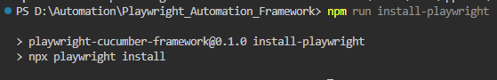
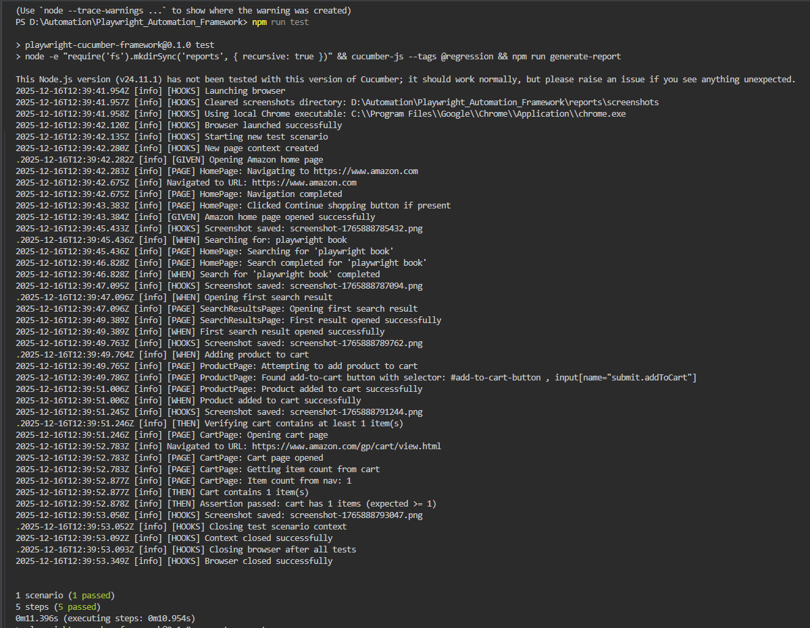
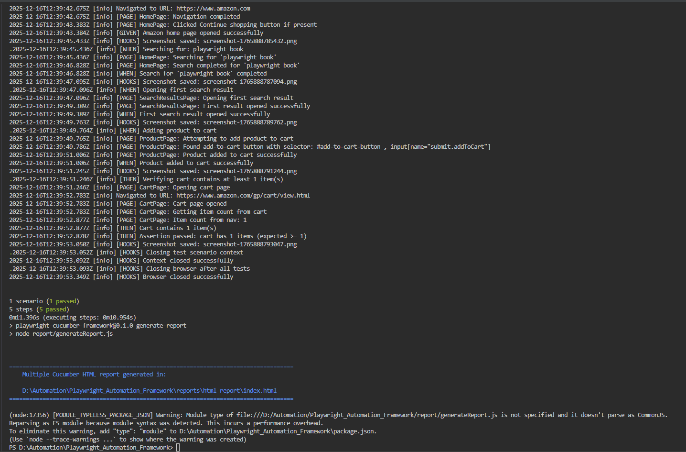
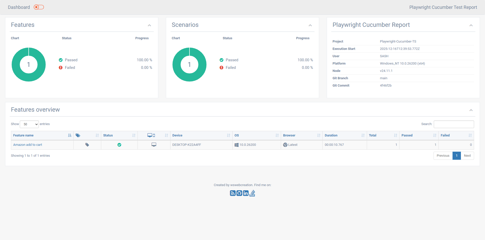
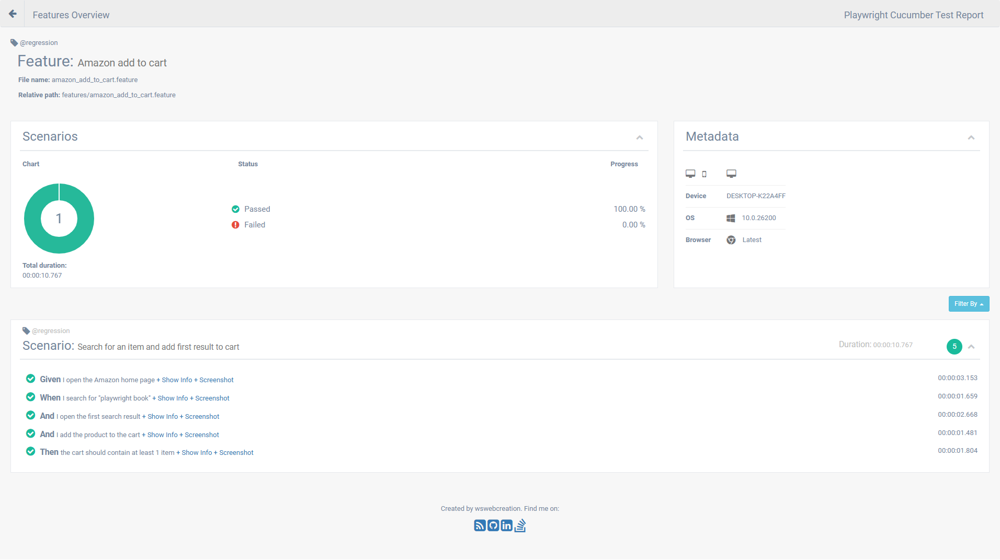
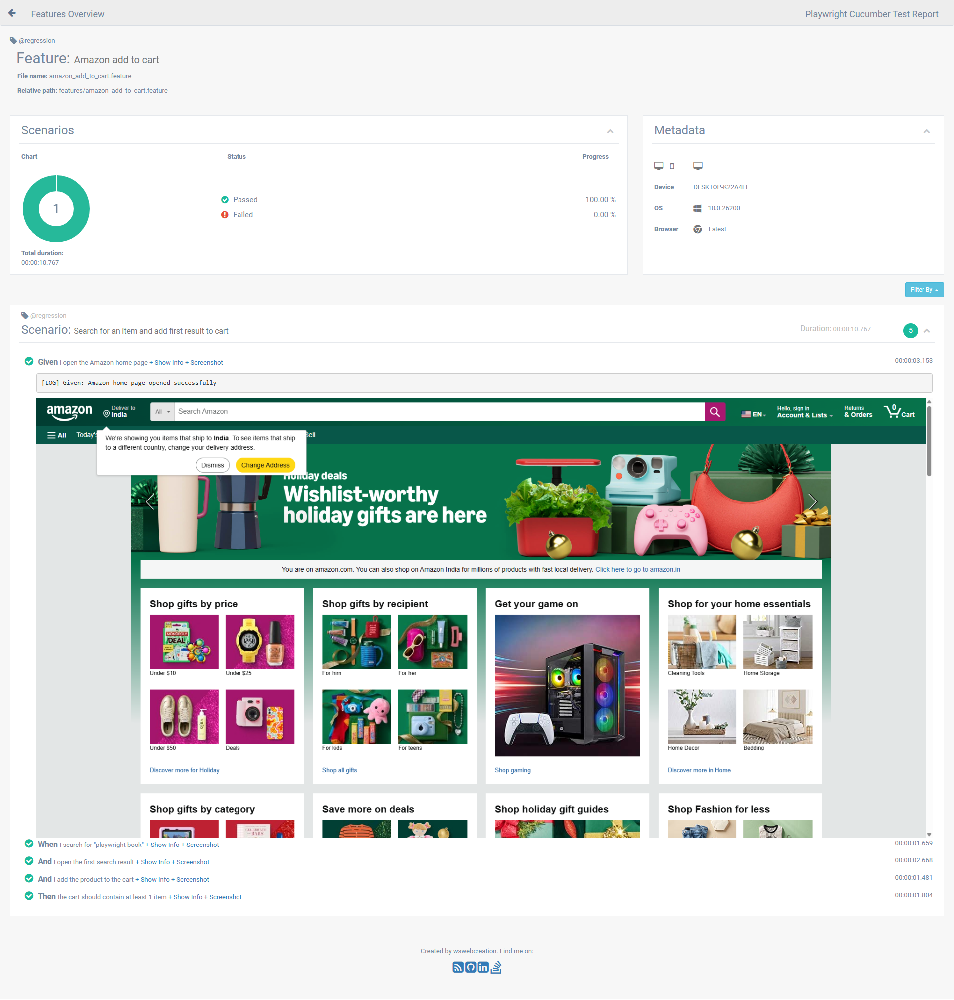

# Playwright Automation Framework

A Playwright (Core library) + Cucumber (Gherkin) E2E framework using TypeScript.

[](https://opensource.org/licenses/MIT)

## Overview

Files have been organized at repository root for simplicity. Key folders:

- `features/` — Gherkin `.feature` files (examples under `features/`).
- `features/step_definitions/` — TypeScript step definitions (`Given/When/Then`).
- `pages/` — Page method classes (HomePage, ProductPage, etc.).
- `pageObjects/` — Page object classes (HomePageLocator, ProductPageLocator, etc.).
- `commonMethods/commonPageMethods.ts` — has all the common page methods (click, type, etc.)
- `support/` — Cucumber `world` and `hooks` for setup/teardown.
- `report/` — Report generation script (`generateReport.js`).
- `reports/` — Generated reports and artifacts (JSON, HTML, screenshots, logs).
- `utils/` — Helper utilities (logger, json/excel utils).
- `cucumber.json` — Cucumber configuration file.
- `support/hooks.ts` — Cucumber hooks for setup/teardown.
- `support/world.ts` — Cucumber `world` for Playwright.
- `package.json` — Project configuration.
- `tsconfig.json` — TypeScript configuration.

## Tools Documentation

- [Playwright Core Library API](https://playwright.dev/docs/api/class-playwright)
- [Cucumber Documentation](https://cucumber.io/docs)
- [TypeScript Documentation](https://www.typescriptlang.org/docs/)

## Dependencies List

- [playwright](https://www.npmjs.com/package/playwright)
- [typescript](https://www.npmjs.com/package/typescript)
- [@cucumber/cucumber](https://www.npmjs.com/package/@cucumber/cucumber)
- [fs-extra](https://www.npmjs.com/package/fs-extra)
- [multiple-cucumber-html-reporter](https://www.npmjs.com/package/multiple-cucumber-html-reporter)
- [winston](https://www.npmjs.com/package/winston)
- [dotenv](https://www.npmjs.com/package/dotenv)
- [xlsx](https://www.npmjs.com/package/xlsx)
- [ts-node](https://www.npmjs.com/package/ts-node)
- [chai](https://www.npmjs.com/package/chai)
- [@types/chai](https://www.npmjs.com/package/@types/chai)
- [@types/fs-extra](https://www.npmjs.com/package/@types/fs-extra)
- [@types/node](https://www.npmjs.com/package/@types/node)

## Prerequisites

Node.js (v24.11.1) and npm

Install dependencies:

```bash
npm install
```


```bash
npm run install-playwright
```



## Run tests

Run the test suite and generate reports:

```bash
npm run test
```

Current `test` script (example) loads TypeScript step defs and runs the report generator:

```bash
node -e \"require('fs').mkdirSync('reports', { recursive: true })\" && npx cucumber-js test features/ --tags @regression && npm run generate-report
```

Current `install-playwright` script to install Playwright core library:

```bash
npx playwright install
```

Current `generate-report` script to generate HTML report:

```bash
node report/generateReport.js
```

Notes:

- The test runner now cleans previous logs and screenshots at startup. See `support/hooks.ts` and `utils/logger.ts` for implementation details.
- Reports (JSON + HTML) are written to `reports/`; open `reports/html-report/index.html` to view the HTML report.

## Running specific scenarios

- Refer to `cucumber.json` documentation for more options: [cucumber-js](https://github.com/cucumber/cucumber-js)
- If you want to run only a single scenario, use the `--tags` option (e.g., `npx cucumber-js test features/ --tags @regression`).
- if you want to run only one feature file (e.g., `npx cucumber-js test features/ amazon_add_to_cart.feature`).
- if you want to run scenario using feature file and scenario name (e.g., `npx cucumber-js test features/ --name \"Search for an item and add first result to cart1\"`).
- if you want to run scenario using feature file and scenario line number (e.g., `npx cucumber-js test  \"features/amazon_add_to_cart.feature:4\"`).

## How step definitions are loaded

Step definitions are loaded from `features/step_definitions/**/*.ts`. If Cucumber reports an "Undefined step":

- Verify the Gherkin text exactly matches a `Given`/`When`/`Then` pattern in a step file.
- Ensure the test script requires the correct step definition path (see `package.json` `test` script above).
- If `ts-node` setup is problematic, a quick JS fallback can be added under `features/step_definitions/` (e.g. `amazonSteps.js`) so Cucumber can load the step directly.

## Custom World (`support/world.ts`) notes

The `CustomWorld` exposes optional properties that are created by hooks:

```ts
browser?: Browser;
context?: BrowserContext;
page?: Page;
```

Guard access to these properties in steps (e.g., `if (!this.page) throw new Error('Page not initialized')`).

## Housekeeping behavior

- `utils/logger.ts` ensures `reports/logs` exists and removes previous `test.log` and `exceptions.log` at startup so each run begins with fresh logs.
- `support/hooks.ts` clears `reports/screenshots` at `BeforeAll` so screenshots are from the current run only.

## Extending the framework

- Add feature files to `features/` and implement steps in `features/step_definitions/`.
- Create page objects in `pages/` and reuse them in step definitions.

## Troubleshooting

- If steps are still undefined, run the `cucumber-js` command shown above locally to see which files are being loaded.
- Check relative imports in step definition files after moving files — they may need `../../` adjustments.

If you want, I can also add a short CONTRIBUTING section or CI integration next.

## Screenshots for reference

### Console Output with logs



Report generated logs:


### HTML Report with custom logs and screenshots

Features view:


Scenarios and Steps view:


Logs and screenshots view:
